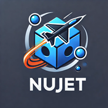
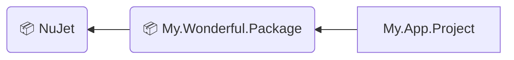

# NuJet



**Enhance your NuGet developer experience! Speed up the inner-loop development and local testing of NuGet packages, and more.**


## 🚀 What is NuJet?
NuJet is a tool designed to make NuGet package development faster, easier, and more efficient. Whether you're building, testing, or troubleshooting your NuGet packages locally, NuJet has got you covered. 

> **"Is it just me, or is local testing of NuGet packages way harder than it should be?"**  
> — *Any frustrated developer who hasn’t tried NuJet yet*

Working with NuGet packages on the local machine often comes with [known issues](#-key-features---what-problem-does-nujet-solve).

How can you solve these problems? Simply include NuJet in your package project, just like any other package... and that's it!

You can now instantly test your package in other projects locally — no more continuous, unnecessary version bumps or cache issues!


## 👨‍💻 How it works
When a package project includes NuJet as a reference, every build will automatically pack a pre-release version (with a `"-Local"` suffix) and copy it to a [Local Feed](https://learn.microsoft.com/en-us/nuget/hosting-packages/local-feeds).

In NuJet, by default, the Local Feed is a `.localPackages` directory located under the [_Global-Packages folder_](https://learn.microsoft.com/en-us/nuget/consume-packages/managing-the-global-packages-and-cache-folders) on your local machine:
- `%userprofile%\.nuget\packages\.localPackages` (on Windows) or
- `~/.nuget/packages/.localPackages` (on MacOS or Linux)

### Example:
- `My.Wonderful.Package`: a package project with version `1.2.3`
- `My.App.Project`: a project that uses `My.Wonderful.Package`



When you build the `My.Wonderful.Package` project with Visual Studio, a file named `My.Wonderful.Package.1.2.3-Local.nupkg` will be copied to the `.localPackages` directory.

When testing  `My.App.Project`, you simply reference this local pre-release version (`1.2.3-Local`) of the `My.Wonderful.Package` package.

This version will be automatically updated with every build, eliminating inconvenient caching issues.
On your local machine you no longer need to modify the .csproj files or manually bump versions!

> [!NOTE]
> Of course, bumping the version is still important.
However, you can now leave this task to your project's CI/CD pipeline, or do the bump manually only when you're ready to release an official version of the package!

See the How-To section for more information! [TODO]


## 🛠 Installation  
To get started with NuJet, add it to your package project using the NuGet package manager:

```bash
dotnet add package NuJet
```

Your project file will now include the following:
```
<ItemGroup>
  <PackageReference Include="NuJet" Version="0.0.1">
    <PrivateAssets>all</PrivateAssets>
    <IncludeAssets>runtime; build; native; contentfiles; analyzers; buildtransitive</IncludeAssets>
  </PackageReference>
</ItemGroup>
```

Now on every build your package will be packed with an additional `"-Local"` suffix in the Local Feed (a `.localPackages` folder) on your machine.


## 📄 Configuration  
NuJet is designed to work with minimal configuration.
However, your consumers projects need to find your Local pre-release packages: add the Local Feed in your `nuget.config` [file](https://learn.microsoft.com/en-us/nuget/consume-packages/configuring-nuget-behavior#config-file-locations-and-uses).

In short, for Windows add this line:

```
<add key="Local packages for Windows" value="%userprofile%\.nuget\packages\.localPackages" />
```

For MacOS or Linux:

```
<add key="Local packages for MacOS" value="~/.nuget/packages/.localPackages" />
```

The result will look similar to:

```
<?xml version="1.0" encoding="utf-8"?>
<configuration>
	<packageSources>
		<add key="nuget.org" value="https://api.nuget.org/v3/index.json" protocolVersion="3" />
		<add key="Local packages for Windows" value="%userprofile%\.nuget\packages\.localPackages" />
		<add key="Local packages for MacOS" value="~/.nuget/packages/.localPackages" />
	</packageSources>
</configuration>
```

Now the local pre-release version of your package can be found by consumer projects.


## 🎯 Key Features - What Problem Does NuJet Solve?
Developing and testing multiple interdependent NuGet packages locally can be a frustrating and time-consuming process. 
Common challenges include:
- Version management headaches: Repeatedly bumping version numbers for local testing
- Cache issues: When the version number remains the same, NuGet often fails to recognize updated versions of your package without manual intervention.
- Time inefficiencies: Switching between projects to bump versions and test changes disrupts your workflow.

These problems are not uncommon and have been discussed extensively in the NuGet community. For instance, the following GitHub issues highlight these frustrations:

* [NuGet/Home#6579: Enhance the experience for the testing of packages in development](https://github.com/NuGet/Home/issues/6579)
* [NuGet/Home#9366: Improve inner-loop testing for packages](https://github.com/NuGet/Home/issues/9366)
* [NuGet/Home#8745: Force no cache for single package source in nuget.config](https://github.com/NuGet/Home/issues/8745)
* [NuGet/Home#13918: \[Feature Request\] Disable caching for Local Feed](https://github.com/NuGet/Home/issues/13918)
* [NuGet/Home#8251: \[Feature Request\] Disable caching for local/file system feeds](https://github.com/NuGet/Home/issues/8251)
* [NuGet/Home#5713: NuGet locals command should allow deleting specific packages from NuGet global packages folder](https://github.com/NuGet/Home/issues/5713)
* [NuGet/Home#10377: Remove specific package from cache](https://github.com/NuGet/Home/issues/10377)
* [NuGet/Home#7678: There is no way to force a true reinstall of a package from the actual source](https://github.com/NuGet/Home/issues/7678)
* [NuGet/Home#12515: Add ability to preempt nuget search with local folder ('NuGetPrefetchFolder')](https://github.com/NuGet/Home/issues/12515)
* [NuGet/Home#9891: Feature request - Option to update user global packages folder automatically after successful pack](https://github.com/NuGet/Home/issues/9891)

NuJet eliminates these hurdles by automating the creation and management of local pre-release versions of your package. 

With NuJet:
- **Speedy Local Testing**: Simplify and accelerate the process of testing your `.nupkg` files locally.
	- Local builds are seamlessly available for testing without manual configuration.
	- Cache problems and unnecessary version bumps are a thing of the past.
	- You can focus on development and testing, rather than battling infrastructure issues.
- **Enhanced Developer Experience**: Enjoy a smoother, faster inner-loop development process.
	- NuJet makes your NuGet development workflow faster, simpler, and more reliable!
- **Flexible and Extensible**: Works seamlessly with existing tools and workflows.


## 👨‍💻📝 Contributing  
We welcome contributions to NuJet! Whether you're fixing bugs, improving documentation, or adding new features, feel free to open an issue or submit a pull request.


## 📜 License  
NuJet is licensed under the [MIT License](LICENSE).


## 📦 Package Status  
NuJet is currently in **alpha** stage. It is actively being developed, but we recommend using it for testing purposes only.
